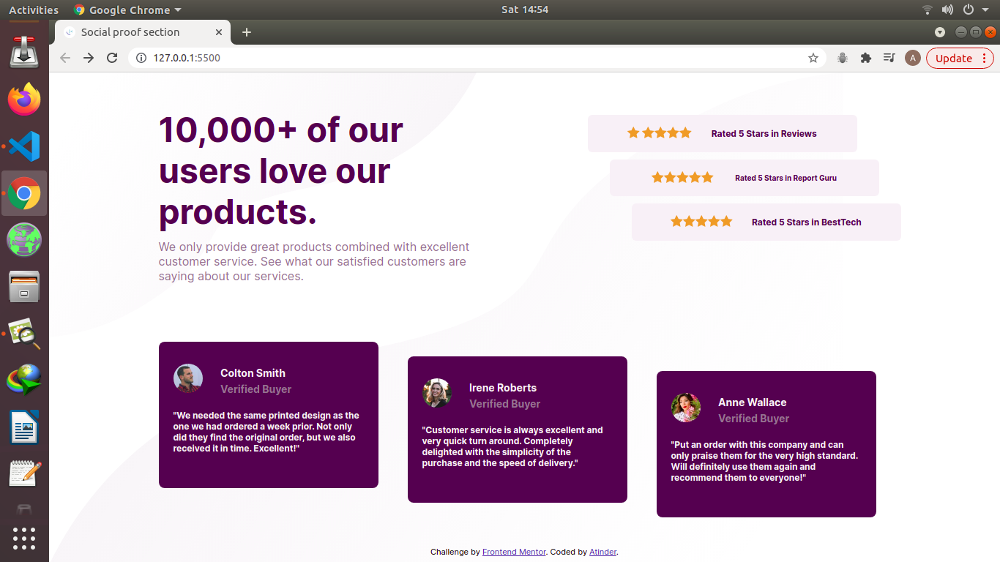

# Frontend Mentor - Social proof section solution

## Table of contents

- [Screenshot](#screenshot)
- [Links](#links)
- [Built with](#built-with)
- [Author](#author)

### Screenshot

### Links

- Solution URL: [Solution](https://github.com/atinderbirsin/frontEndMentor/tree/main/social-proof-section-master)
- Live Site URL: [Live Site](https://social-prooff.netlify.app/)

### Built with

- Semantic HTML5 markup
- CSS custom properties
- Flexbox
- CSS Grid
- Mobile-first workflow

## Author

- Website - [Atinder](https://github.com/atinderbirsin)
- Frontend Mentor - [@Atinder](https://www.frontendmentor.io/profile/atinderbirsin)
